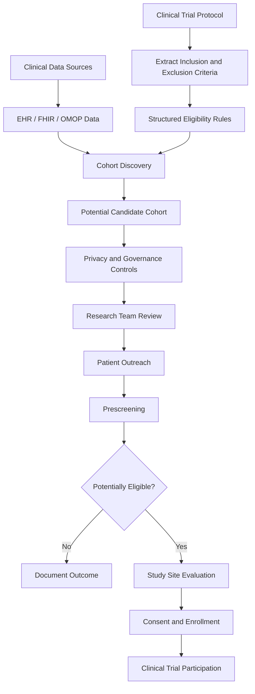
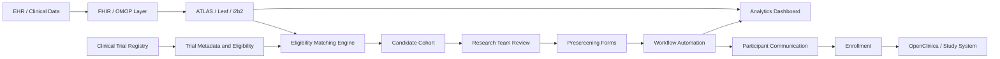

# Awesome-Patient-Recruitment

## Top Patient Recruitment Ecosystem

**Curated List of SaaS Products & Open-Source GitHub Projects**

*Focused on Clinical Trial Patient Recruitment, Participant Discovery, Cohort Identification, Eligibility Matching, Prescreening, Patient Engagement & Enrollment*

**Last updated: August 2026**

This repository tracks notable **SaaS/hosted platforms**, commercial products and **open-source projects** for **Patient Recruitment** in clinical trials and medical research. These tools help sponsors, CROs, research institutions and study sites identify potentially eligible participants, build patient cohorts, match patients against inclusion and exclusion criteria, manage recruitment campaigns, prescreen candidates, engage participants and improve clinical trial enrollment.

**Examples** include Trialbee, AutoCruitment, SubjectWell, Clara Health, Antidote, Inato, Deep 6 AI, BrightInsight, Elligo Health and StudyKIK.

**Open-source emphasis**: This section is heavily expanded with major open-source projects for clinical cohort discovery, EHR querying, patient-to-trial matching, genomic trial matching, OMOP-based eligibility analysis, clinical data integration, trial registry search and research workflow management. The open-source landscape does not yet contain many complete equivalents to commercial direct-to-patient recruitment agencies, but it provides powerful building blocks for creating self-hosted patient recruitment and cohort-identification systems.

**Frameworks for building custom systems** can combine **OHDSI ATLAS**, **Leaf**, **i2b2**, **MatchMiner**, **Criteria2Query**, **OpenClinica**, **OpenMRS**, **HAPI FHIR**, **REDCap-compatible research workflows**, **Node-RED**, **n8n**, **PostgreSQL**, **Grafana** and AI frameworks for custom patient recruitment pipelines.

Contributions welcome! Open a PR to add/update entries. Keep descriptions factual and link to official sites or GitHub repositories.

## Table of Contents

* [SaaS/Hosted Platforms](#saashosted-platforms)

* [Open-Source GitHub Projects](#open-source-github-projects)

* [Additional Strong Open-Source Options](#additional-strong-open-source-options)

* [Frameworks for Building Custom Patient Recruitment Systems](#frameworks-for-building-custom-patient-recruitment-systems)

* [How to Contribute](#how-to-contribute)

* [Disclaimer](#disclaimer)

## SaaS/Hosted Platforms

| Platform | Description | Pricing (Starting Tier) | Free Tier / Free Trial Limits |
| :--- | :--- | :--- | :--- |
| **[Trialbee](https://www.trialbee.com/)** | Digital patient recruitment and engagement platform (Honey Platform) focused on participant identification, prescreening, and enrollment analytics. | Starts at $2,500/month per active study (or $15,000/study campaign package) | Free forever for patients to browse and match; 14-day free pilot trial for sponsors/CROs (limited to 1 study protocol sandbox) |
| **[AutoCruitment](https://www.autocruitment.com/)** | Digital patient recruitment platform utilizing targeted online outreach, prescreening workflows, and milestone-aligned outcome tracking. | Starts at $2,000/month base management fee + performance milestone tier (~25%–70% outcome fees per consented patient) | Free forever for patients seeking clinical trials; 30-day trial feasibility assessment (1 protocol screening simulation) |
| **[SubjectWell](https://subjectwell.com/)** | Risk-free clinical trial patient recruitment marketplace with dedicated Patient Companions and global candidate pools. | Starts at $0 upfront fee; $500 – $2,500 per randomized patient depending on therapeutic area | Free forever for patients to join research pool; 100% risk-free sponsor access (no cost until patient successfully randomizes) |
| **[Clara Health](https://clarahealth.com/)** | Patient-centered clinical research discovery and care navigation platform supporting participant engagement and recruitment. | Starts at $25/month for patient health record navigation; sponsor study campaigns start at $3,500/study | Free forever for patients and caregivers (unlimited trial searches, eligibility filtering, and coordinator chat); 14-day sponsor trial |
| **[Antidote](https://www.antidote.me/)** | Clinical trial search engine and precision patient matching platform connecting participants with medical studies. | Starts at $1,500 upfront calibration fee / $250 – $1,500 per qualified patient referral | Free forever for patients using Antidote Match (unlimited trial searches and matching questionnaires); 30-day sponsor sandbox |
| **[Inato](https://inato.com/)** | Community research site marketplace matching trial sponsors with hospital sites to expand patient diversity and access. | Free for community research sites; sponsor access starts at $5,000 per study site-matching campaign | Free forever for community research sites (unlimited trial discovery and site profile listings); 14-day sponsor feasibility trial |
| **[Deep 6 AI](https://deep6.ai/)** | AI and NLP-powered clinical trial acceleration platform querying structured and unstructured EHR data for real-time patient matching. | Starts at $4,000/month per health facility deployment (or $50,000/year institutional tier) | 30-day free pilot trial for health systems (limited to 1 EHR connector and up to 10 clinical study queries) |
| **[BrightInsight](https://www.brightinsight.com/)** | Regulated digital health and decentralized clinical trial platform for connected medical devices, companion apps, and patient workflows. | Starts at $5,000/month infrastructure base tier for regulated SaMD and digital trial data services | 30-day developer sandbox trial (includes 1 simulated device integration, mock patient telemetry, and API sandbox) |
| **[Elligo Health Research](https://www.elligohealthresearch.com/)** | Healthcare-integrated clinical research network connecting trial sponsors with physician practices and EHR patient pools. | Starts at $1,500 – $3,000 per enrolled patient with low baseline site enablement fee | Free forever for community physicians and patients to participate in trial networks; 14-day feasibility assessment for sponsors |
| **[StudyKIK](https://studykik.com/)** | Clinical trial recruitment platform utilizing social media communities, digital pre-screening (StudyForms), and mobile engagement. | Starts at $2,200 per 30-day campaign (Platinum Tier; Diamond at $3,800/30d, Ruby at $5,800/30d) | Free forever for patients (unlimited study browsing, signups, and stipend tracking); 14-day trial for research sites (lead portal access) |
| **[OpenClinica Study Hub](https://www.openclinica.com/)** | Cloud clinical data management and participant recruitment/eConsent platform supporting decentralized and hybrid studies. | Starts at $750/month (single-study tier) or $1,000/month (enterprise EDC/Study Hub starter) | 30-day free trial (full EDC & Study Hub sandbox with 1 study build and up to 25 mock patient records); Community Edition is 100% free open-source |
| **[Science 37](https://www.science37.com/)** | Decentralized clinical trial platform (Metasite OS) enabling patient recruitment, telemedicine visits, and home-based clinical trials. | Starts at $4,500/month per active virtual study cohort (or milestone-based enrollment pricing) | Free forever for trial participants (unlimited telemedicine visits and mobile app); 14-day demo sandbox for investigators |
| **[Medable](https://www.medable.com/)** | Modular decentralized clinical trial platform for eConsent, eCOA/ePRO, telehealth, and direct-to-patient recruitment. | Starts at $3,000/month per study for core eConsent/ePRO modules (or $35,000/year base package) | Free forever for patient participants; 30-day sandbox trial for study teams (up to 1 study build and 50 test submissions) |
| **[THREAD](https://www.threadresearch.com/)** | Decentralized research and eCOA platform supporting hybrid, virtual, and site-based clinical studies. | Starts at $3,500/month per active study protocol for standard recruitment and remote eConsent/eCOA modules | Free forever for clinical trial participants; 14-day sponsor trial (includes trial design sandbox and 1 protocol workflow template) |
| **[Medidata Patient Cloud](https://www.medidata.com/)** | Clinical trial technology suite providing eConsent, myMedidata participant portals, eCOA, and recruitment registries. | Starts at $1,000/user/month (entry CTMS/study module) or $4,000/month per active clinical study | Free forever for patients on myMedidata registry; 30-day trial sandbox for registered CROs (up to 1 study configuration) |
| **[TriNetX](https://trinetx.com/)** | Global federated health research network providing real-world EHR data for feasibility, cohort identification, and clinical trial matching. | Starts at $2,500/month per research seat (or $25,000/year investigator query subscription) | Free forever for participating healthcare organizations contributing de-identified EHR data; 14-day trial (up to 10 cohort queries) |
| **[Komodo Health](https://www.komodohealth.com/)** | Healthcare map and real-world patient-journey analytics platform for cohort discovery, diversity tracking, and site selection. | Starts at $1,667/month (billed annually at $20,000/year) for entry cohort analytics modules | 14-day trial for research analysts (includes sample patient journey dataset and up to 5 cohort query runs) |
| **[IQVIA Patient Recruitment](https://www.iqvia.com/)** | End-to-end patient recruitment and retention solutions combining real-world healthcare data, targeted digital outreach, and nurse navigators. | Starts at $3,000/month base management fee + $800 – $2,000 per consented/randomized patient | Free forever for patients searching clinical studies on IQVIA Clinical Research portal; 14-day feasibility trial for sponsors |
| **[Parexel Patient Recruitment](https://www.parexel.com/)** | Full-service patient recruitment, engagement, and retention solutions leveraging genomic intelligence and site networks. | Starts at $3,500/month study management tier + performance-based enrollment milestone fees | Free forever for patient community members; 14-day trial protocol feasibility review for biotech sponsors |
| **[Syneos Health](https://www.syneoshealth.com/)** | Integrated clinical and commercial platform offering behavioral patient recruitment, digital advertising, and site-support teams. | Starts at $3,000/month management retainer + tiered milestone fees per enrolled participant | Free forever for patients seeking clinical trial matching; 14-day sponsor feasibility analysis trial |
| **[Mural Health](https://www.muralhealth.com/)** | Participant management platform offering patient stipends, travel arrangements, communication, and retention tracking (Mural Link). | Starts at $500/month per active study + $5 – $15 transaction fee per participant stipend disbursement | Free forever for clinical trial participants (zero payout/transfer fees and no inactivity fees); 30-day free trial for research sites (up to 20 participant payments) |
| **[PatientPoint](https://www.patientpoint.com/)** | Point-of-care digital engagement network across physician waiting rooms and exam rooms for patient recruitment campaigns. | Starts at $1,500/month per specialty clinic cluster for recruitment campaign placements | Free forever for medical provider practices (complimentary digital screens and hardware); 30-day advertising campaign trial for sponsors |
| **[Clinical Trial Media](https://clinicaltrialmedia.com/)** | Global patient recruitment agency providing omni-channel marketing, screening landing pages, and candidate tracking portals. | Starts at $2,500/month campaign management fee (or $350 – $1,800 per qualified randomized patient) | Free forever for patients browsing and applying to clinical trials; 14-day trial feasibility and demographic reach assessment for sponsors |
| **[TrialSpark](https://www.trialspark.com/)** | Tech-driven drug development and clinical trial execution platform with integrated recruitment and automated site workflows. | Starts at $5,000/month platform operational fee (or risk-shared co-development / milestone-based models) | Free forever for trial participants; 14-day trial protocol optimization and recruitment feasibility simulation for sponsors |
| **[Carebox Connect](https://www.careboxhealth.com/)** | Patient-to-trial matching technology and widget platform connecting patients, oncologists, and healthcare centers to clinical studies. | Starts at $500/month for web widget & trial search integration (or $50/lead unlock token packages) | Free forever for patients and caregivers (unlimited trial matching and navigation); 30-day free trial for research centers (includes 5 free patient lead unlocks) |
| **[Rare Patient Voice](https://rarepatientvoice.com/)** | Patient community and recruitment platform specializing in rare and complex diseases for clinical studies and surveys. | Starts at $250 flat set-up fee (feasibility studies); recruitment starting at $120 – $300 per qualified patient interview/referral | Free forever for patients and caregivers (earns ~$120/hr honorarium for participating); 14-day free feasibility inquiry for researchers (1 study criteria check) |

## Open-Source GitHub Projects

### Direct Clinical Trial Matching and Patient-to-Trial Discovery

* **[TrialThread](https://github.com/ericporres/trialthread)**

  Open-source AI-assisted clinical-trial matching project that searches live clinical-trial registry data and evaluates patient descriptions against trial eligibility criteria. Designed as a patient-facing matching layer with transparent eligibility reasoning.

* **[MatchMiner](https://github.com/dfci/matchminer)**

  Major open-source platform developed at Dana-Farber Cancer Institute for matching patient-specific genomic and clinical profiles to precision-medicine clinical trials.

* **[Criteria2Query](https://github.com/OHDSI/Criteria2Query)**

  Open-source cohort-identification project that converts free-text clinical eligibility criteria into structured queries for identifying potential patient cohorts.

* **[ClinicalTrials.gov API Tools](https://github.com/search?q=clinicaltrials.gov+API&type=repositories)**

  Community-maintained open-source libraries and applications for searching, processing and integrating ClinicalTrials.gov trial registry data into recruitment and matching workflows.

* **[Clinical Trial Matching Projects](https://github.com/search?q=open+source+clinical+trial+matching&type=repositories)**

  Community projects focused on matching patient profiles, diagnoses, locations and eligibility criteria to clinical trials.

* **[TrialGPT Research Implementations](https://github.com/search?q=TrialGPT+clinical+trial+matching&type=repositories)**

  Open-source and research-oriented implementations inspired by language-model approaches for matching patient records and clinical profiles to trial eligibility criteria.

### OHDSI and OMOP Cohort Discovery

* **[OHDSI ATLAS](https://github.com/OHDSI/Atlas)**

  One of the most important open-source platforms for patient cohort discovery and observational healthcare analysis. ATLAS allows researchers to define cohorts based on diagnoses, drugs, procedures, observations and other standardized OMOP clinical data.

* **[OHDSI WebAPI](https://github.com/OHDSI/WebAPI)**

  Open-source backend service supporting ATLAS and other OHDSI applications, providing cohort-definition and observational research capabilities.

* **[OHDSI ATLAS WebAPI Ecosystem](https://github.com/OHDSI)**

  Broad open-source ecosystem supporting OMOP Common Data Model analytics, cohort identification, phenotype development and observational research.

* **[OHDSI Cohort Generator](https://github.com/OHDSI/CohortGenerator)**

  Open-source R package ecosystem for generating patient cohorts from OMOP Common Data Model databases.

* **[OHDSI PatientLevelPrediction](https://github.com/OHDSI/PatientLevelPrediction)**

  Open-source framework for developing patient-level predictive models that can support population stratification and recruitment feasibility.

* **[OHDSI PhenotypeLibrary](https://github.com/OHDSI/PhenotypeLibrary)**

  Community phenotype definitions that can help research organizations identify patient populations using standardized cohort logic.

### Clinical Cohort Discovery Platforms

* **[Leaf Clinical Data Explorer](https://github.com/uwrit/leaf)**

  Open-source, model-agnostic web application for querying clinical databases, estimating patient cohorts and extracting clinical research datasets.

* **[i2b2](https://github.com/i2b2/i2b2-core-server)**

  Major open-source clinical research informatics platform providing self-service querying and cohort discovery across large clinical datasets.

* **[SHRINE](https://github.com/SHRINE/shrine)**

  Open-source federated clinical-data querying platform designed to enable researchers to query distributed clinical research networks while maintaining institutional control of data.

* **[tranSMART](https://github.com/transmart/transmartApp)**

  Open-source translational research platform supporting integration and exploration of clinical and molecular research data.

* **[cBioPortal](https://github.com/cBioPortal/cbioportal)**

  Major open-source cancer genomics platform that can support exploration of patient and genomic data relevant to precision-medicine trial matching.

* **[REDCap Integration Projects](https://github.com/search?q=REDCap+clinical+trial+open+source&type=repositories)**

  Community tools and integrations that extend research data collection systems into recruitment, participant management and research workflows.

### Clinical Data Platforms for Recruitment Workflows

* **[OpenClinica](https://github.com/OpenClinica/OpenClinica)**

  Open-source Electronic Data Capture and Clinical Data Management platform supporting study setup, participant visits, clinical workflows, audit trails and research operations.

* **[OpenMRS](https://github.com/openmrs/openmrs-core)**

  Major open-source electronic medical record platform that can provide patient and clinical data foundations for institution-managed recruitment and cohort-identification systems.

* **[OpenEMR](https://github.com/openemr/openemr)**

  Open-source electronic health record and practice-management platform that can serve as a self-hosted clinical data source for research recruitment workflows.

* **[GNU Health](https://github.com/gnuhealth)**

  Open-source health and hospital information ecosystem that can support patient data management and research-oriented extensions.

* **[OpenEHR Specifications and Tools](https://github.com/openEHR)**

  Open healthcare information architecture and software ecosystem supporting interoperable clinical data systems.

### FHIR-Based Patient Discovery and Interoperability

* **[HAPI FHIR](https://github.com/hapifhir/hapi-fhir)**

  Widely used open-source FHIR server and healthcare interoperability platform that can provide a standards-based clinical data layer for patient identification and recruitment applications.

* **[Firely Server](https://github.com/FirelyTeam/firely-server)**

  Open-source FHIR server supporting healthcare interoperability and FHIR-based clinical applications.

* **[FHIR Shorthand](https://github.com/FHIR/FSH)**

  Open-source tooling for creating and maintaining FHIR implementation artifacts.

* **[SMART on FHIR](https://github.com/smart-on-fhir)**

  Open standards and reference implementations supporting secure applications that interact with healthcare systems through FHIR APIs.

* **[FHIR Clinical Trial Projects](https://github.com/search?q=FHIR+clinical+trial+recruitment&type=repositories)**

  Community projects integrating FHIR patient data with clinical research and trial-matching workflows.

### Clinical NLP and Eligibility Criteria Processing

* **[Apache cTAKES](https://github.com/apache/ctakes)**

  Major open-source clinical natural-language processing platform for extracting structured information from clinical text.

* **[MedCAT](https://github.com/CogStack/MedCAT)**

  Open-source clinical NLP and concept-annotation framework useful for extracting diagnoses, medications and other clinical concepts from unstructured healthcare data.

* **[CogStack](https://github.com/CogStack)**

  Open-source clinical data platform and NLP ecosystem supporting analysis of large volumes of healthcare data.

* **[scispaCy](https://github.com/allenai/scispacy)**

  Open-source NLP library providing scientific and biomedical language processing capabilities.

* **[medSpaCy](https://github.com/medspacy/medspacy)**

  Open-source clinical NLP library designed for processing clinical text using spaCy-based pipelines.

* **[Clinical NLP Projects](https://github.com/search?q=open+source+clinical+NLP&type=repositories)**

  Community projects for extracting structured patient information from clinical notes and unstructured healthcare records.

### Trial Registry and Study Metadata

* **[ClinicalTrials.gov API Clients](https://github.com/search?q=clinicaltrials.gov+client&type=repositories)**

  Open-source libraries for retrieving clinical-trial metadata, eligibility criteria, recruitment status and study locations.

* **[ClinicalTrials.gov Data Processing Tools](https://github.com/search?q=clinicaltrials.gov+parser&type=repositories)**

  Community parsers and ETL pipelines for transforming clinical-trial registry information into searchable databases.

* **[AACT ClinicalTrials.gov Database](https://aact.ctti-clinicaltrials.org/)**

  Public clinical-trial data resource that can be used as a foundation for self-hosted trial search, analytics and recruitment-matching applications.

* **[OpenTrials](https://github.com/opentrials)**

  Open-data and software initiatives related to improving access to clinical trial information and research transparency.

### Patient Communication and Engagement Building Blocks

* **[n8n](https://github.com/n8n-io/n8n)**

  Open-source workflow automation platform useful for building recruitment pipelines, communication workflows, CRM integrations and participant follow-up processes.

* **[Node-RED](https://github.com/node-red/node-red)**

  Open-source flow-based programming platform useful for connecting healthcare APIs, databases, messaging systems and recruitment workflows.

* **[Mautic](https://github.com/mautic/mautic)**

  Open-source marketing automation platform that can support consent-aware recruitment communications, email workflows and engagement campaigns where appropriate.

* **[Listmonk](https://github.com/knadh/listmonk)**

  Open-source mailing-list and newsletter platform suitable for opt-in study awareness and participant communication workflows.

* **[Chatwoot](https://github.com/chatwoot/chatwoot)**

  Open-source customer and participant communication platform that can be adapted for study inquiry and engagement workflows.

* **[Cal.com](https://github.com/calcom/cal.com)**

  Open-source scheduling infrastructure useful for arranging participant prescreening, investigator calls and study appointments.

### Forms, Prescreening and Consent Building Blocks

* **[Formbricks](https://github.com/formbricks/formbricks)**

  Open-source survey and experience-management platform that can be adapted for participant prescreening questionnaires and research feedback.

* **[LimeSurvey](https://github.com/LimeSurvey/LimeSurvey)**

  Mature open-source survey platform suitable for building structured prescreening and participant questionnaires.

* **[SurveyJS](https://github.com/surveyjs/survey-library)**

  Open-source survey and form-building framework useful for custom clinical-trial prescreening applications.

* **[ODK](https://github.com/getodk)**

  Open-source data collection ecosystem that can support mobile and field-based participant screening and research data collection.

* **[KoBoToolbox](https://github.com/kobotoolbox)**

  Open-source data collection ecosystem useful for structured questionnaires and distributed research data collection.

### Research Workflow and Data Integration

* **[OpenClinica](https://github.com/OpenClinica/OpenClinica)**

  Open-source clinical study management and EDC foundation that can be integrated into recruitment-to-enrollment workflows.

* **[OpenSpecimen](https://github.com/krishagni/openspecimen)**

  Open-source biospecimen and biobanking platform that can support research cohort management and translational studies.

* **[LabKey Server Community](https://github.com/LabKey)**

  Open-source research data platform supporting scientific data integration, study management and cohort-oriented research workflows.

* **[OpenClinica Integrations](https://github.com/search?q=OpenClinica+integration&type=repositories)**

  Community integrations for extending open clinical-trial workflows.

* **[Apache NiFi](https://github.com/apache/nifi)**

  Open-source data-flow automation platform useful for integrating EHR, FHIR, OMOP, trial registry and recruitment systems.

* **[Apache Airflow](https://github.com/apache/airflow)**

  Open-source workflow orchestration platform suitable for scheduled patient cohort refreshes and recruitment data pipelines.

### Analytics and Recruitment Intelligence

* **[Apache Superset](https://github.com/apache/superset)**

  Open-source analytics and visualization platform useful for recruitment dashboards, enrollment reporting and cohort analysis.

* **[Metabase](https://github.com/metabase/metabase)**

  Open-source business intelligence platform useful for participant funnel analysis and recruitment performance reporting.

* **[Grafana](https://github.com/grafana/grafana)**

  Open-source dashboarding platform suitable for monitoring recruitment operations and enrollment metrics.

* **[Jupyter](https://github.com/jupyter)**

  Open-source computational environment useful for patient cohort analysis, eligibility research and recruitment modeling.

### AI-Assisted Recruitment and Matching Frameworks

* **[Ollama](https://github.com/ollama/ollama)**

  Open-source local AI platform useful for private experimentation with clinical-trial eligibility analysis and retrieval-assisted workflows.

* **[LocalAI](https://github.com/mudler/LocalAI)**

  Open-source self-hosted AI platform for running language models within controlled infrastructure.

* **[LangChain](https://github.com/langchain-ai/langchain)**

  Open-source framework for connecting language models with clinical-trial registries, databases and retrieval systems.

* **[LangGraph](https://github.com/langchain-ai/langgraph)**

  Open-source framework for stateful AI agents and multi-step clinical-trial matching workflows.

* **[Haystack](https://github.com/deepset-ai/haystack)**

  Open-source AI framework suitable for retrieval-augmented systems that search trial protocols, eligibility criteria and research knowledge.

* **[RAG Clinical Trial Projects](https://github.com/search?q=RAG+clinical+trial+matching&type=repositories)**

  Community projects applying retrieval-augmented generation and language models to clinical-trial search and eligibility matching.

## Additional Strong Open-Source Options

* **Patient cohort discovery**: OHDSI ATLAS, Leaf, i2b2, SHRINE and tranSMART.

* **Eligibility criteria processing**: Criteria2Query, clinical NLP pipelines and custom OMOP cohort definitions.

* **Precision-medicine matching**: MatchMiner and cBioPortal-based workflows.

* **EHR and clinical data**: OpenMRS, OpenEMR, GNU Health and OpenEHR ecosystems.

* **Healthcare interoperability**: HAPI FHIR, Firely Server and SMART on FHIR.

* **Clinical NLP**: Apache cTAKES, MedCAT, CogStack, scispaCy and medSpaCy.

* **Trial registry integration**: ClinicalTrials.gov API clients, AACT and OpenTrials-related projects.

* **Clinical trial operations**: OpenClinica and OpenSpecimen.

* **Prescreening forms**: LimeSurvey, Formbricks, SurveyJS, ODK and KoBoToolbox.

* **Participant communication**: n8n, Node-RED, Mautic, Listmonk and Chatwoot.

* **Scheduling**: Cal.com and custom FHIR-integrated appointment workflows.

* **Data pipelines**: Apache NiFi and Apache Airflow.

* **Analytics**: Metabase, Apache Superset, Grafana and Jupyter.

* **AI-assisted matching**: Ollama, LocalAI, LangChain, LangGraph and Haystack.

* Many specialized projects exist for **clinical-trial search, OMOP phenotyping, EHR cohort queries, eligibility parsing, biomedical NLP and patient matching**.

**Important distinction**: Most commercial Patient Recruitment companies provide access to advertising networks, patient communities, recruitment services and operational teams. Open-source alternatives are generally strongest for **cohort discovery, EHR-based eligibility matching, trial matching, participant prescreening and workflow automation** rather than replacing commercial patient-acquisition networks.

## Frameworks for Building Custom Patient Recruitment Systems

A practical open-source patient recruitment architecture can combine:

**Clinical Data Source** → OpenMRS / OpenEMR / EHR / Data Warehouse

**Healthcare Interoperability** → HAPI FHIR / SMART on FHIR

**Clinical Data Standardization** → OMOP Common Data Model

**Cohort Discovery** → OHDSI ATLAS / Leaf / i2b2

**Eligibility Processing** → Criteria2Query / Clinical NLP

**Trial Registry** → ClinicalTrials.gov API / AACT

**Patient-to-Trial Matching** → MatchMiner / Custom Matching Engine

**Prescreening** → LimeSurvey / Formbricks / SurveyJS

**Clinical Study Operations** → OpenClinica

**Workflow Automation** → n8n / Node-RED / Apache Airflow

**Participant Communication** → Chatwoot / Mautic / Email / SMS Integrations

**Analytics** → Metabase / Superset / Grafana

**AI Assistant** → Ollama / LocalAI

**AI Workflow** → LangChain / LangGraph

**Audit and Governance** → Git / Access Controls / Database Audit Logs

A strong general-purpose self-hosted stack could be:

**OMOP + OHDSI ATLAS + HAPI FHIR + ClinicalTrials.gov API + n8n + Metabase**

For an academic medical center:

**i2b2 + Leaf + OMOP + OHDSI ATLAS + OpenClinica**

For precision oncology recruitment:

**Clinical Genomics Data + MatchMiner + cBioPortal + ClinicalTrials.gov Data**

For AI-assisted eligibility matching:

**FHIR / OMOP + Clinical NLP + Criteria2Query + Trial Registry + Ollama + LangGraph**

For decentralized participant engagement:

**OpenClinica + Formbricks + Cal.com + n8n + Chatwoot**

## Patient Recruitment Workflow

## Open-Source Patient Recruitment Architecture

## Patient Recruitment Data Model

A typical Patient Recruitment Platform may include:

* Clinical Trial

* Study Protocol

* Sponsor

* CRO

* Research Site

* Investigator

* Patient

* Participant

* Candidate

* Contact

* Recruitment Source

* Referral

* Diagnosis

* Condition

* Medication

* Laboratory Result

* Procedure

* Biomarker

* Genomic Variant

* Inclusion Criterion

* Exclusion Criterion

* Eligibility Rule

* Cohort

* Prescreening Questionnaire

* Screening Status

* Recruitment Campaign

* Communication

* Consent Status

* Study Visit

* Site Location

* Distance

* Recruitment Funnel Stage

* Enrollment Status

* Withdrawal Status

* Audit Record

## Common Patient Recruitment Features

A complete Patient Recruitment Platform may support:

* Clinical trial discovery

* Patient-to-trial matching

* EHR-based cohort discovery

* OMOP cohort definitions

* FHIR integration

* Eligibility criteria parsing

* Inclusion/exclusion rule management

* AI-assisted eligibility matching

* Genomic trial matching

* Patient population analysis

* Site feasibility

* Recruitment forecasting

* Digital advertising

* Landing pages

* Referral workflows

* Patient CRM

* Candidate tracking

* Prescreening questionnaires

* Email engagement

* SMS engagement

* Reminder automation

* Scheduling

* eConsent integration

* Research-site referral

* Recruitment funnel analytics

* Enrollment analytics

* Diversity and representation monitoring

* Audit trails

* Role-based access controls

* Privacy controls

* Data de-identification

* API integrations

## Patient Recruitment Lifecycle

## AI-Assisted Patient Recruitment

Potential AI-assisted capabilities include:

* Natural-language eligibility criteria parsing

* Protocol summarization

* Inclusion and exclusion extraction

* EHR note analysis

* Clinical concept extraction

* Patient cohort estimation

* Patient-to-trial matching

* Genomic trial matching

* Candidate prioritization

* Prescreening assistance

* Trial search

* Study-site recommendations

* Recruitment funnel analysis

* Recruitment forecasting

* Participant communication drafting

* Research coordinator assistance

A recommended safety-oriented architecture is:

**Clinical Data → Structured Cohort Discovery → AI-Assisted Eligibility Analysis → Clinical Validation → Authorized Research Team Review → Patient Contact**

AI systems should **not independently determine medical eligibility or directly enroll patients without appropriate clinical and research oversight**.

## Patient Recruitment KPIs

Useful metrics include:

* Patients identified

* Potentially eligible patients

* Contact rate

* Response rate

* Prescreening completion rate

* Screening rate

* Screen failure rate

* Enrollment rate

* Recruitment rate per site

* Recruitment rate per campaign

* Cost per lead

* Cost per enrolled participant

* Time to first patient enrolled

* Recruitment cycle time

* Enrollment target achievement

* Referral-to-enrollment conversion

* Candidate dropout rate

* Participant retention rate

* Geographic recruitment coverage

* Representation across demographic groups

* Protocol amendment impact

* Recruitment forecast accuracy

## How to Contribute

1. Fork the repo.

2. Add/edit entries in `README.md` following the existing format.

3. Include: name, link, a 1–2 sentence description and whether it is SaaS/hosted or open-source.

4. Clearly indicate whether an open-source project is a complete recruitment system, cohort-discovery platform, matching engine, clinical-data platform or supporting component.

5. Prefer actively maintained projects with clear licenses and documentation.

6. Submit a PR with a short explanation.

Star the repo if you find it useful!

## Disclaimer

* This is a **community-curated** list — not exhaustive and not an endorsement.

* Patient recruitment and clinical research involve sensitive health information and must comply with applicable privacy, ethics and research regulations.

* Patient data should not be uploaded to public repositories, public AI services or third-party systems without appropriate authorization and safeguards.

* Cohort-discovery results identify potential candidates and do not independently establish medical eligibility.

* Final eligibility decisions should be made according to the approved study protocol and by appropriately qualified clinical and research personnel.

* AI-generated eligibility assessments can contain errors and require human review.

* Patient outreach, consent, advertising and recruitment practices must follow applicable IRB/IEC requirements and local regulations.

* Open-source components may require substantial integration, validation, security engineering and governance before use in regulated clinical research.

* Self-hosted systems require strong access controls, audit logging, encryption, backup procedures and privacy protections.

---

**Made for clinical researchers, sponsors, CROs, research coordinators, healthcare organizations, biomedical informaticians, patient advocates and developers building open clinical research infrastructure.**

Let's make clinical trial recruitment more **open, interoperable, patient-centered, transparent and data-driven**.
