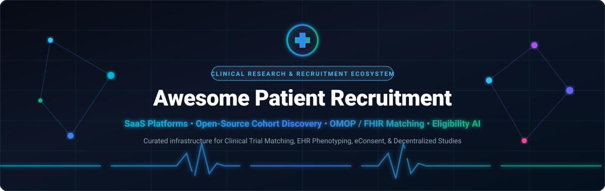
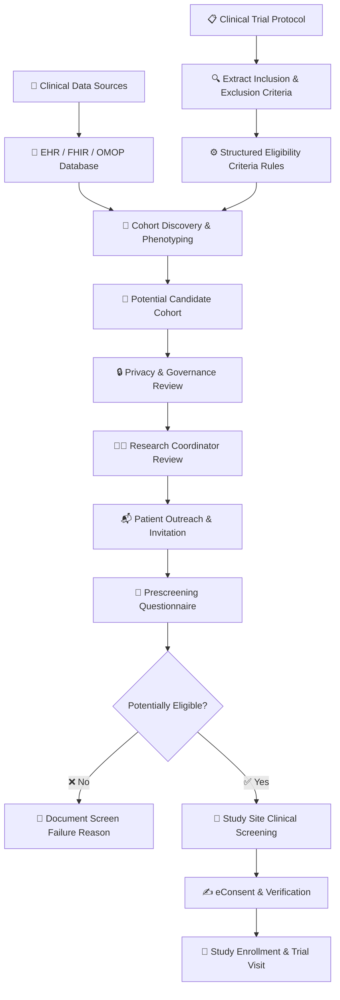
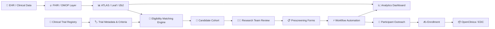
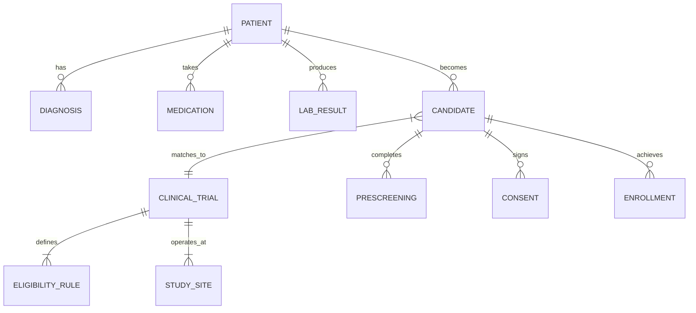

# 🏥 Awesome Patient Recruitment 🧬

<p align="center">
  
</p>

<p align="center">
  <a href="https://github.com/ishandutta2007/Awesome-Awesome-Awesome"></a><a href="https://discord.gg/jc4xtF58Ve"></a>
  <a href="https://github.com/ishandutta2007/Awesome-Patient-Recruitment/stargazers"></a>
  <a href="https://github.com/ishandutta2007/Awesome-Patient-Recruitment/network/members"></a>
  <a href="https://github.com/ishandutta2007/Awesome-Patient-Recruitment/blob/main/LICENSE"></a>
  <a href="https://github.com/ishandutta2007"></a>
</p>

---

## 🎯 Overview & Scope

A curated, comprehensive directory of top **SaaS platforms**, commercial enterprise solutions, and **open-source software** powering **Patient Recruitment**, participant discovery, clinical cohort identification, inclusion/exclusion eligibility parsing, genomic trial matching, eConsent, and enrollment operations for clinical research and decentralized clinical trials (DCT).

> **SEO Keywords**: `patient recruitment`, `clinical trial matching`, `cohort discovery`, `EHR phenotyping`, `OMOP Common Data Model`, `FHIR clinical trials`, `clinical NLP`, `eligibility criteria matching`, `decentralized clinical trials`, `electronic data capture`, `eConsent`, `clinical trial registry`, `precision medicine recruitment`.

---

## 📑 Table of Contents

* [🏢 SaaS / Hosted Platforms](#-saashosted-platforms)
* [💻 Open-Source GitHub Projects](#-open-source-github-projects)
  * [🎯 Direct Clinical Trial Matching & Patient-to-Trial Discovery](#-direct-clinical-trial-matching--patient-to-trial-discovery)
  * [🧬 OHDSI and OMOP Cohort Discovery](#-ohdsi-and-omop-cohort-discovery)
  * [🏥 Clinical Cohort Discovery Platforms](#-clinical-cohort-discovery-platforms)
  * [🩺 Clinical Data Platforms for Recruitment Workflows](#-clinical-data-platforms-for-recruitment-workflows)
  * [🔥 FHIR-Based Patient Discovery & Interoperability](#-fhir-based-patient-discovery--interoperability)
  * [🧠 Clinical NLP & Eligibility Criteria Processing](#-clinical-nlp--eligibility-criteria-processing)
  * [📜 Trial Registry & Study Metadata](#-trial-registry--study-metadata)
  * [📬 Patient Communication & Engagement Automation](#-patient-communication--engagement-automation)
  * [📋 Forms, Prescreening & Consent Building Blocks](#-forms-prescreening-and-consent-building-blocks)
  * [🔄 Research Workflow & Data Integration](#-research-workflow-and-data-integration)
  * [📊 Analytics & Recruitment Intelligence](#-analytics-and-recruitment-intelligence)
  * [🤖 AI-Assisted Recruitment & Matching Frameworks](#-ai-assisted-recruitment-and-matching-frameworks)
* [🌟 Additional Strong Open-Source Options](#-additional-strong-open-source-options)
* [🏗️ Frameworks for Building Custom Patient Recruitment Systems](#️-frameworks-for-building-custom-patient-recruitment-systems)
* [🔄 Patient Recruitment Workflow](#-patient-recruitment-workflow)
* [📐 Open-Source Patient Recruitment Architecture](#-open-source-patient-recruitment-architecture)
* [📊 Patient Recruitment Data Model](#-patient-recruitment-data-model)
* [✨ Common Patient Recruitment Features](#-common-patient-recruitment-features)
* [🔁 Patient Recruitment Lifecycle](#-patient-recruitment-lifecycle)
* [🤖 AI-Assisted Patient Recruitment](#-ai-assisted-patient-recruitment)
* [📈 Patient Recruitment KPIs](#-patient-recruitment-kpis)
* [📈 Star History](#-star-history)
* [🤝 How to Contribute](#-how-to-contribute)
* [⚖️ Disclaimer](#️-disclaimer)

---


## 🏢 SaaS/Hosted Platforms

> **📊 Sector Market Size & Market Structure**: The global clinical trial patient recruitment and retention market is estimated at **~$3.8B – $5.2B in 2025–2026** and projected to exceed **$11.8B – $17.5B by 2033** (CAGR ~8.2%–8.9%). The industry is **moderately-to-highly fragmented**, consisting of specialized patient marketing startups, niche therapeutic network agencies, decentralized trial technology providers (DCT), and major global Contract Research Organizations (CROs like IQVIA, Parexel, and Syneos Health). It is not a single winner-take-all monopoly due to wide therapeutic area sub-specialization, diverse regional IRB/regulatory frameworks, and local healthcare site dependencies.

| 🏢 Platform | 📝 Description & Primary Focus | 💰 Pricing (Starting Tier) | 🎁 Free Tier / Free Trial Limits | 📊 Company Valuation / Revenue Scale |
| :--- | :--- | :--- | :--- | :--- |
| **[IQVIA Patient Recruitment](https://www.iqvia.com/)** | Global CRO & clinical research technology conglomerate providing data-driven participant recruitment, real-world data, and decentralized trials. | Starts at $3,000/month base management fee + $800 – $2,000 per consented/randomized patient | Free forever for patients searching clinical studies on IQVIA Clinical Research portal; 14-day feasibility trial for sponsors | ~$47.86B Market Cap / ~$17.2B Annual Revenue |
| **[Parexel Patient Recruitment](https://www.parexel.com/)** | Full-service clinical research organization delivering global patient recruitment, digital marketing, and site intelligence networks. | Starts at $3,500/month study management tier + performance-based enrollment milestone fees | Free forever for patient community members; 14-day trial protocol feasibility review for biotech sponsors | ~$8.5B Acquisition Valuation / ~$2.3B+ Annual Revenue |
| **[Medidata Patient Cloud](https://www.medidata.com/)** | Clinical trial technology suite by Dassault Systèmes providing eConsent, myMedidata participant portals, eCOA, and trial registries. | Starts at $1,000/user/month (entry CTMS/study module) or $4,000/month per active clinical study | Free forever for patients on myMedidata registry; 30-day trial sandbox for registered CROs (up to 1 study configuration) | ~$5.7B Acquisition Valuation / ~$1.0B+ Division Revenue |
| **[Syneos Health](https://www.syneoshealth.com/)** | Integrated biopharmaceutical solutions provider offering behavioral patient recruitment, multichannel outreach, and site enablement. | Starts at $3,000/month management retainer + tiered milestone fees per enrolled participant | Free forever for patients seeking clinical trial matching; 14-day sponsor feasibility analysis trial | ~$4.3B – $4.5B Enterprise Valuation / ~$5.3B Annual Revenue |
| **[Komodo Health](https://www.komodohealth.com/)** | Healthcare Map and real-world patient journey analytics platform for cohort discovery, diversity tracking, and clinical trial site selection. | Starts at $1,667/month (billed annually at $20,000/year) for entry cohort analytics modules | 14-day trial for research analysts (includes sample patient journey dataset and up to 5 cohort query runs) | ~$3.3B Valuation / ~$175M+ Annual Revenue |
| **[Medable](https://www.medable.com/)** | Modular decentralized clinical trial (DCT) platform for digital eConsent, eCOA/ePRO, telehealth, and direct-to-patient recruitment. | Starts at $3,000/month per study for core eConsent/ePRO modules (or $35,000/year base package) | Free forever for patient participants; 30-day sandbox trial for study teams (up to 1 study build and 50 test submissions) | ~$2.1B Valuation / Series D Unicorn |
| **[TriNetX](https://trinetx.com/)** | Global federated health research network providing real-world EHR data for feasibility, cohort identification, and clinical trial matching. | Starts at $2,500/month per research seat (or $25,000/year investigator query subscription) | Free forever for participating healthcare organizations contributing de-identified EHR data; 14-day trial (up to 10 cohort queries) | ~$2.0B Valuation / ~$40M+ Annual Revenue |
| **[PatientPoint](https://www.patientpoint.com/)** | Point-of-care digital engagement network across physician waiting rooms and exam rooms for patient education and recruitment campaigns. | Starts at $1,500/month per specialty clinic cluster for recruitment campaign placements | Free forever for medical provider practices (complimentary digital screens and hardware); 30-day advertising campaign trial for sponsors | ~$1.0B+ Valuation / ~$200M+ Annual Revenue |
| **[TrialSpark](https://www.trialspark.com/)** | Tech-enabled drug development and clinical trial execution platform (Formation Bio) with integrated recruitment and automated site workflows. | Starts at $5,000/month platform operational fee (or risk-shared co-development / milestone-based models) | Free forever for trial participants; 14-day trial protocol optimization and recruitment feasibility simulation for sponsors | ~$1.0B+ Valuation / Series D Unicorn |
| **[BrightInsight](https://www.brightinsight.com/)** | Regulated digital health and decentralized clinical trial platform for connected medical devices, companion apps, and patient workflows. | Starts at $5,000/month infrastructure base tier for regulated SaMD and digital trial data services | 30-day developer sandbox trial (includes 1 simulated device integration, mock patient telemetry, and API sandbox) | ~$750M Valuation / ~$30M+ Annual Revenue |
| **[Elligo Health Research](https://www.elligohealthresearch.com/)** | Healthcare-integrated clinical research network connecting trial sponsors with physician practices and EHR patient pools. | Starts at $1,500 – $3,000 per enrolled patient with low baseline site enablement fee | Free forever for community physicians and patients to participate in trial networks; 14-day feasibility assessment for sponsors | ~$400M Valuation / $135M+ Total Funding |
| **[THREAD](https://www.threadresearch.com/)** | Decentralized research and eCOA platform supporting hybrid, virtual, and decentralized clinical studies globally. | Starts at $3,500/month per active study protocol for standard recruitment and remote eConsent/eCOA modules | Free forever for clinical trial participants; 14-day sponsor trial (includes trial design sandbox and 1 protocol workflow template) | ~$250M – $350M Valuation / $100M+ Total Funding |
| **[Deep 6 AI](https://deep6.ai/)** | AI and NLP-powered clinical trial acceleration platform querying structured and unstructured EHR data for real-time patient matching. | Starts at $4,000/month per health facility deployment (or $50,000/year institutional tier) | 30-day free pilot trial for health systems (limited to 1 EHR connector and up to 10 clinical study queries) | ~$150M Valuation / $30M+ Total Funding |
| **[Inato](https://inato.com/)** | Community research site marketplace matching trial sponsors with community hospital sites to expand patient diversity. | Free for community research sites; sponsor access starts at $5,000 per study site-matching campaign | Free forever for community research sites (unlimited trial discovery and site profile listings); 14-day sponsor feasibility trial | ~$120M Valuation / $35M+ Total Funding |
| **[SubjectWell](https://subjectwell.com/)** | Risk-free clinical trial patient recruitment marketplace with dedicated Patient Companions and global candidate pools. | Starts at $0 upfront fee; $500 – $2,500 per randomized patient depending on therapeutic area | Free forever for patients to join research pool; 100% risk-free sponsor access (no cost until patient successfully randomizes) | ~$100M Valuation / $35M+ Total Funding |
| **[Trialbee](https://www.trialbee.com/)** | Digital patient recruitment and engagement platform (Honey Platform) focused on participant identification, prescreening, and enrollment analytics. | Starts at $2,500/month per active study (or $15,000/study campaign package) | Free forever for patients to browse and match; 14-day free pilot trial for sponsors/CROs (limited to 1 study protocol sandbox) | ~$80M Valuation / $30M+ Total Funding |
| **[AutoCruitment](https://www.autocruitment.com/)** | Digital patient recruitment platform utilizing targeted online outreach, prescreening workflows, and milestone-aligned outcome tracking. | Starts at $2,000/month base management fee + performance milestone tier (~25%–70% outcome fees per consented patient) | Free forever for patients seeking clinical trials; 30-day trial feasibility assessment (1 protocol screening simulation) | ~$75M Valuation / ~$20M+ Annual Revenue |
| **[Antidote](https://www.antidote.me/)** | Clinical trial search engine and precision patient matching platform connecting participants with medical studies. | Starts at $1,500 upfront calibration fee / $250 – $1,500 per qualified patient referral | Free forever for patients using Antidote Match (unlimited trial searches and matching questionnaires); 30-day sponsor sandbox | ~$65M Valuation / $35M+ Total Funding |
| **[StudyKIK](https://studykik.com/)** | Clinical trial recruitment platform (Syneos Health) utilizing social media communities, digital pre-screening (StudyForms), and mobile portals. | Starts at $2,200 per 30-day campaign (Platinum Tier; Diamond at $3,800/30d, Ruby at $5,800/30d) | Free forever for patients (unlimited study browsing, signups, and stipend tracking); 14-day trial for research sites (lead portal access) | ~$60M Acquisition Valuation / ~$25M Revenue |
| **[Science 37](https://www.science37.com/)** | Decentralized clinical trial platform (Metasite OS by eMed) enabling patient recruitment, telemedicine visits, and home-based trials. | Starts at $4,500/month per active virtual study cohort (or milestone-based enrollment pricing) | Free forever for trial participants (unlimited telemedicine visits and mobile app); 14-day demo sandbox for investigators | ~$38M Acquisition Valuation / ~$60M Annual Revenue |
| **[Mural Health](https://www.muralhealth.com/)** | Participant management platform offering patient stipends, travel arrangements, communication, and retention tracking (Mural Link). | Starts at $500/month per active study + $5 – $15 transaction fee per participant stipend disbursement | Free forever for clinical trial participants (zero payout/transfer fees and no inactivity fees); 30-day free trial for research sites (up to 20 participant payments) | ~$35M Valuation / $8M+ Total Funding |
| **[Clinical Trial Media](https://clinicaltrialmedia.com/)** | Global patient recruitment agency providing omni-channel marketing, screening landing pages, and candidate tracking portals. | Starts at $2,500/month campaign management fee (or $350 – $1,800 per qualified randomized patient) | Free forever for patients browsing and applying to clinical trials; 14-day trial feasibility and demographic reach assessment for sponsors | ~$25M – $35M Estimated Annual Revenue |
| **[OpenClinica Study Hub](https://www.openclinica.com/)** | Cloud clinical data management and participant recruitment/eConsent platform supporting decentralized and hybrid studies. | Starts at $750/month (single-study tier) or $1,000/month (enterprise EDC/Study Hub starter) | 30-day free trial (full EDC & Study Hub sandbox with 1 study build and up to 25 mock patient records); Community Edition is 100% free open-source | ~$20M – $30M Estimated Annual Revenue |
| **[Rare Patient Voice](https://rarepatientvoice.com/)** | Patient community and recruitment platform specializing in rare and complex diseases for clinical studies and qualitative surveys. | Starts at $250 flat set-up fee (feasibility studies); recruitment starting at $120 – $300 per qualified patient interview/referral | Free forever for patients and caregivers (earns ~$120/hr honorarium for participating); 14-day free feasibility inquiry for researchers (1 study criteria check) | ~$20M – $25M Estimated Annual Revenue |
| **[Carebox Connect](https://www.careboxhealth.com/)** | Patient-to-trial matching technology and widget platform connecting patients, oncologists, and healthcare centers to clinical studies. | Starts at $500/month for web widget & trial search integration (or $50/lead unlock token packages) | Free forever for patients and caregivers (unlimited trial matching and navigation); 30-day free trial for research centers (includes 5 free patient lead unlocks) | ~$15M – $25M Valuation |
| **[Clara Health](https://clarahealth.com/)** | Patient-centered clinical research discovery and care navigation platform (Trialbee) supporting participant engagement and recruitment. | Starts at $25/month for patient health record navigation; sponsor study campaigns start at $3,500/study | Free forever for patients and caregivers (unlimited trial searches, eligibility filtering, and coordinator chat); 14-day sponsor trial | ~$10M – $15M Acquisition Valuation |


## 💻 Open-Source GitHub Projects

### 🎯 Direct Clinical Trial Matching & Patient-to-Trial Discovery

* **[TrialGPT](https://github.com/bionlplab/TrialGPT)** [](https://github.com/bionlplab/TrialGPT/stargazers)
  An end-to-end LLM-based agent developed for matching patient summaries and electronic health records to clinical trials with verifiable criterion-level explanations.

* **[MatchMiner](https://github.com/dfci/matchminer)** [](https://github.com/dfci/matchminer/stargazers)
  Major open-source precision medicine platform developed at Dana-Farber Cancer Institute for matching patient-specific genomic and clinical profiles to precision oncology clinical trials.

* **[Criteria2Query](https://github.com/OHDSI/Criteria2Query)** [](https://github.com/OHDSI/Criteria2Query/stargazers)
  Natural-language cohort identification system developed within OHDSI that parses free-text inclusion/exclusion criteria into executable OMOP SQL queries.

* **[TrialThread](https://github.com/ericporres/trialthread)** [](https://github.com/ericporres/trialthread/stargazers)
  Open-source AI-assisted clinical-trial matching engine that searches live clinical-trial registries and evaluates patient medical descriptions against study eligibility criteria with reasoning transparency.

* **[C-T-MATCH](https://github.com/lhncbc/C-T-MATCH)** [](https://github.com/lhncbc/C-T-MATCH/stargazers)
  Clinical trial matching algorithms and evaluation tools developed by the Lister Hill National Center for Biomedical Communications (NLM/NIH).

---

### 🧬 OHDSI and OMOP Cohort Discovery

* **[OHDSI ATLAS](https://github.com/OHDSI/Atlas)** [](https://github.com/OHDSI/Atlas/stargazers)
  The foundational open-source web platform for defining complex patient cohorts, phenotyping clinical conditions, and conducting observational research across OMOP Common Data Model databases.

* **[OHDSI WebAPI](https://github.com/OHDSI/WebAPI)** [](https://github.com/OHDSI/WebAPI/stargazers)
  Open-source backend REST API service supporting ATLAS, managing OMOP CDM cohort definitions, vocabulary queries, characterizations, and incidence rates.

* **[OHDSI PatientLevelPrediction](https://github.com/OHDSI/PatientLevelPrediction)** [](https://github.com/OHDSI/PatientLevelPrediction/stargazers)
  Open-source R framework for building, validating, and evaluating patient-level predictive models for study enrollment feasibility and risk stratification.

* **[OHDSI CohortGenerator](https://github.com/OHDSI/CohortGenerator)** [](https://github.com/OHDSI/CohortGenerator/stargazers)
  R package designed for generating cohort instances from standardized OMOP CDM cohort definitions with high performance and cohort counting.

* **[OHDSI Capr](https://github.com/OHDSI/Capr)** [](https://github.com/OHDSI/Capr/stargazers)
  Code-as-cohort framework allowing clinical researchers to programmatically author and maintain reproducible OMOP cohort definitions in R.

* **[OHDSI PhenotypeLibrary](https://github.com/OHDSI/PhenotypeLibrary)** [](https://github.com/OHDSI/PhenotypeLibrary/stargazers)
  Community-validated phenotype definitions for identifying specific patient populations across global clinical data networks.

---

### 🏥 Clinical Cohort Discovery Platforms

* **[cBioPortal](https://github.com/cBioPortal/cbioportal)** [](https://github.com/cBioPortal/cbioportal/stargazers)
  Comprehensive open-source cancer genomics platform supporting interactive exploration of multidimensional clinical and genomic datasets for precision trial matching.

* **[i2b2 Core Server](https://github.com/i2b2/i2b2-core-server)** [](https://github.com/i2b2/i2b2-core-server/stargazers)
  Informatics for Integrating Biology & the Bedside — scalable clinical research data warehouse platform enabling self-service cohort queries and participant identification.

* **[Leaf Clinical Data Explorer](https://github.com/uwrit/leaf)** [](https://github.com/uwrit/leaf/stargazers)
  Modern, lightweight, user-friendly clinical data querying web tool developed at University of Washington for querying EHR data, estimating cohort counts, and extracting research datasets.

* **[tranSMART App](https://github.com/transmart/transmartApp)** [](https://github.com/transmart/transmartApp/stargazers)
  Translational research informatics platform for integrating clinical trials data, high-throughput biomarkers, and patient phenotypes.

* **[SHRINE](https://github.com/SHRINE/shrine)** [](https://github.com/SHRINE/shrine/stargazers)
  Shared Health Research Informatics Network — federated querying infrastructure enabling multi-institutional cohort estimation across networked i2b2 nodes.

---

### 🩺 Clinical Data Platforms for Recruitment Workflows

* **[OpenEMR](https://github.com/openemr/openemr)** [](https://github.com/openemr/openemr/stargazers)
  ONC-certified open-source electronic health records and medical practice management platform supporting patient demographics, problem lists, and research query extensions.

* **[OpenMRS Core](https://github.com/openmrs/openmrs-core)** [](https://github.com/openmrs/openmrs-core/stargazers)
  Extensible open-source medical record system platform powering healthcare facilities globally and providing clinical data foundations for institutional recruitment pipelines.

* **[OpenClinica](https://github.com/OpenClinica/OpenClinica)** [](https://github.com/OpenClinica/OpenClinica/stargazers)
  Open-source Electronic Data Capture (EDC) and Clinical Data Management system supporting clinical study protocols, eCRFs, subject tracking, and regulatory audit trails.

* **[GNU Health](https://github.com/gnuhealth/gnuhealth)** [](https://github.com/gnuhealth/gnuhealth/stargazers)
  Free, open-source Hospital and Health Information System (HIS/EHR) supporting socioeconomic data, genetics, patient records, and epidemiology.

---

### 🔥 FHIR-Based Patient Discovery & Interoperability

* **[HAPI FHIR](https://github.com/hapifhir/hapi-fhir)** [](https://github.com/hapifhir/hapi-fhir/stargazers)
  Complete open-source Java implementation of the HL7 FHIR standard for healthcare data storage, interoperability, and search APIs required for real-time patient-trial matching.

* **[SMART on FHIR Client JS](https://github.com/smart-on-fhir/client-js)** [](https://github.com/smart-on-fhir/client-js/stargazers)
  JavaScript library for building SMART-on-FHIR clinical applications that securely integrate directly into clinician workflows and EHR patient screening charts.

* **[Google FHIR](https://github.com/google/fhir)** [](https://github.com/google/fhir/stargazers)
  Google's open-source suite of software tools and protocol buffer definitions for handling, querying, and transforming HL7 FHIR healthcare data at scale.

* **[Firely Server](https://github.com/FirelyTeam/firely-server)** [](https://github.com/FirelyTeam/firely-server/stargazers)
  High-performance open-source .NET HL7 FHIR server (formerly Vonk) supporting interoperable healthcare data exchange and search queries.

* **[FHIR Shorthand (FSH)](https://github.com/FHIR/FSH)** [](https://github.com/FHIR/FSH/stargazers)
  Domain-specific language and compiler (SUSHI) for defining clinical trial profiles, research data models, and FHIR implementation guides.

---

### 🧠 Clinical NLP & Eligibility Criteria Processing

* **[Spark NLP](https://github.com/JohnSnowLabs/spark-nlp)** [](https://github.com/JohnSnowLabs/spark-nlp/stargazers)
  State-of-the-art Natural Language Processing library with pretrained biomedical and clinical models for entity recognition, assertion status, and medical terminology resolution.

* **[scispaCy](https://github.com/allenai/scispacy)** [](https://github.com/allenai/scispacy/stargazers)
  Specialized spaCy pipeline developed by the Allen Institute for AI for processing biomedical, scientific, and clinical texts into structured entities.

* **[medSpaCy](https://github.com/medspacy/medspacy)** [](https://github.com/medspacy/medspacy/stargazers)
  Clinical NLP library built on spaCy with modular components for clinical section detection, context analysis (negation, uncertainty), and concept mapping.

* **[CogStack MedCAT](https://github.com/CogStack/MedCAT)** [](https://github.com/CogStack/MedCAT/stargazers)
  Medical Concept Annotation Toolkit for extracting and linking clinical concepts (SNOMED-CT, UMLS) from unstructured electronic health record clinical notes.

* **[Apache cTAKES](https://github.com/apache/ctakes)** [](https://github.com/apache/ctakes/stargazers)
  Natural language processing system for extraction of structured clinical information from electronic medical record narrative free-text.

---

### 📜 Trial Registry & Study Metadata

* **[AACT Database Tools](https://github.com/CTTI-ClinicalTrials/aact)** [](https://github.com/CTTI-ClinicalTrials/aact/stargazers)
  Relational PostgreSQL database pipeline and schema for transforming the entirety of ClinicalTrials.gov into queryable relational data for eligibility research.

* **[OpenTrials](https://github.com/opentrials/opentrials)** [](https://github.com/opentrials/opentrials/stargazers)
  Open-data initiative and API repository indexing clinical trial registry information from multiple global registries to increase research accessibility.

* **[ChEMBL Clinical Trials API Client](https://github.com/chembl/clinical-trials-api-client)** [](https://github.com/chembl/clinical-trials-api-client/stargazers)
  Python client library for querying and retrieving structured clinical trial protocol and eligibility information from international trial registries.

---

### 📬 Patient Communication & Engagement Automation

* **[n8n](https://github.com/n8n-io/n8n)** [](https://github.com/n8n-io/n8n/stargazers)
  Fair-code workflow automation tool for connecting clinical databases, prescreening webhooks, SMS alerts, calendar scheduling, and recruitment pipeline logic.

* **[Cal.com](https://github.com/calcom/cal.com)** [](https://github.com/calcom/cal.com/stargazers)
  Open-source scheduling infrastructure enabling candidate self-scheduling for clinical trial coordinator screening calls and site visits.

* **[Chatwoot](https://github.com/chatwoot/chatwoot)** [](https://github.com/chatwoot/chatwoot/stargazers)
  Open-source omnichannel customer engagement platform for managing candidate live chat, WhatsApp, email, and trial coordinator communications.

* **[Node-RED](https://github.com/node-red/node-red)** [](https://github.com/node-red/node-red/stargazers)
  Low-code event-driven programming platform for wiring together healthcare APIs, IoT trial wearables, databases, and patient engagement triggers.

* **[Listmonk](https://github.com/knadh/listmonk)** [](https://github.com/knadh/listmonk/stargazers)
  High-performance newsletter and mailing list manager suitable for privacy-compliant opt-in patient registry updates and study notifications.

* **[Mautic](https://github.com/mautic/mautic)** [](https://github.com/mautic/mautic/stargazers)
  Open-source marketing automation platform providing multi-stage nurture email sequences, SMS alerts, and lead scoring for clinical recruitment funnels.

---

### 📋 Forms, Prescreening & Consent Building Blocks

* **[SurveyJS](https://github.com/surveyjs/survey-library)** [](https://github.com/surveyjs/survey-library/stargazers)
  Open-source JavaScript form and survey library with dynamic conditional branching, ideal for embedding clinical prescreening questionnaires and eligibility scoring.

* **[Formbricks](https://github.com/formbricks/formbricks)** [](https://github.com/formbricks/formbricks/stargazers)
  Privacy-first open-source survey and experience management suite for building multi-step patient prescreening workflows and recruitment feedback forms.

* **[LimeSurvey](https://github.com/LimeSurvey/LimeSurvey)** [](https://github.com/LimeSurvey/LimeSurvey/stargazers)
  Mature, feature-complete open-source survey tool supporting fine-grained quota management, complex branching logic, and secure participant screening.

* **[ODK Collect](https://github.com/getodk/collect)** [](https://github.com/getodk/collect/stargazers)
  Open Data Kit mobile application for offline field screening, clinical participant intake, and community-based trial recruitment data collection.

* **[KoBoToolbox KPI](https://github.com/kobotoolbox/kpi)** [](https://github.com/kobotoolbox/kpi/stargazers)
  Robust survey management platform for humanitarian and global health research data collection in low-resource trial settings.

---

### 🔄 Research Workflow & Data Integration

* **[Apache Airflow](https://github.com/apache/airflow)** [](https://github.com/apache/airflow/stargazers)
  Industry-standard workflow orchestration platform for scheduling periodic EHR ETL jobs, automated OMOP cohort updates, and trial database refreshes.

* **[Apache NiFi](https://github.com/apache/nifi)** [](https://github.com/apache/nifi/stargazers)
  Easy to use, powerful, and reliable system to process and distribute data across disparate clinical systems, HL7 feeds, and trial data warehouses.

* **[OpenSpecimen](https://github.com/krishagni/openspecimen)** [](https://github.com/krishagni/openspecimen/stargazers)
  Open-source biobanking informatics platform for tracking research biospecimens, consent forms, and participant longitudinal study visits.

* **[LabKey Server](https://github.com/LabKey/labkey-server)** [](https://github.com/LabKey/labkey-server/stargazers)
  Scientific data management platform for integrating observational clinical datasets, assay measurements, and patient cohort longitudinal records.

---

### 📊 Analytics & Recruitment Intelligence

* **[Grafana](https://github.com/grafana/grafana)** [](https://github.com/grafana/grafana/stargazers)
  Operational monitoring and visualization platform for real-time tracking of candidate referral rates, site screening velocities, and system uptime.

* **[Apache Superset](https://github.com/apache/superset)** [](https://github.com/apache/superset/stargazers)
  Enterprise-ready business intelligence platform for exploring clinical trial recruitment funnels, demographic diversity, and enrollment timelines.

* **[Metabase](https://github.com/metabase/metabase)** [](https://github.com/metabase/metabase/stargazers)
  User-friendly open-source business intelligence tool that enables study coordinators and PIs to query enrollment SQL tables and build recruitment dashboards without code.

* **[Jupyter Notebook](https://github.com/jupyter/notebook)** [](https://github.com/jupyter/notebook/stargazers)
  Interactive computational environment for developing clinical matching algorithms, analyzing patient cohort distributions, and running statistical feasibility models.

---

### 🤖 AI-Assisted Recruitment & Matching Frameworks

* **[LangChain](https://github.com/langchain-ai/langchain)** [](https://github.com/langchain-ai/langchain/stargazers)
  Framework for developing context-aware AI applications that connect LLMs with clinical trial registries, EHR knowledge graphs, and vector retrieval pipelines.

* **[Ollama](https://github.com/ollama/ollama)** [](https://github.com/ollama/ollama/stargazers)
  Get up and running with Llama 3, Mistral, and biomedical LLMs locally on HIPAA-compliant, air-gapped on-premise infrastructure for private clinical eligibility parsing.

* **[LocalAI](https://github.com/mudler/LocalAI)** [](https://github.com/mudler/LocalAI/stargazers)
  Self-hosted, community-driven OpenAI-compatible API for running local models on CPU and GPU hardware without leaking patient health data to external APIs.

* **[Haystack](https://github.com/deepset-ai/haystack)** [](https://github.com/deepset-ai/haystack/stargazers)
  Production-ready LLM orchestration framework optimized for Retrieval-Augmented Generation (RAG) across clinical trial protocols and medical literature.

* **[LangGraph](https://github.com/langchain-ai/langgraph)** [](https://github.com/langchain-ai/langgraph/stargazers)
  Framework for building stateful, multi-actor AI agent workflows with cyclical graphs, ideal for multi-step patient eligibility matching and verification loops.


## 🌟 Additional Strong Open-Source Options

* 👥 **Patient Cohort Discovery**: OHDSI ATLAS, Leaf, i2b2, SHRINE, and tranSMART.
* ⚙️ **Eligibility Criteria Processing**: Criteria2Query, Spark NLP, scispaCy, medSpaCy, and MedCAT.
* 🧬 **Precision-Medicine Matching**: MatchMiner, TrialGPT, and cBioPortal.
* 🏥 **EHR and Clinical Data Foundations**: OpenMRS, OpenEMR, GNU Health, and openEHR ecosystems.
* 🔥 **Healthcare Interoperability**: HAPI FHIR, Firely Server, Google FHIR, and SMART on FHIR.
* 📜 **Trial Registry Search**: AACT Database, OpenTrials, and ChEMBL Trial Clients.
* 📦 **Study Operations & EDC**: OpenClinica, OpenSpecimen, and LabKey Server.
* 📋 **Prescreening Questionnaires**: SurveyJS, Formbricks, LimeSurvey, ODK, and KoBoToolbox.
* 💬 **Patient Engagement & Automation**: n8n, Node-RED, Cal.com, Chatwoot, Listmonk, and Mautic.
* 📊 **Recruitment Analytics**: Grafana, Apache Superset, Metabase, and Jupyter.
* 🤖 **Local & Private AI Matching**: Ollama, LocalAI, LangChain, LangGraph, and Haystack.

> **💡 Key Takeaway**: While commercial patient recruitment platforms offer ready-to-use patient ad networks and agency services, open-source building blocks provide unprecedented flexibility, data privacy compliance, and zero licensing costs for constructing self-hosted cohort identification, EHR-matching, and prescreening infrastructure.

---

## 🏗️ Frameworks for Building Custom Patient Recruitment Systems

A modular, self-hosted patient recruitment stack can be assembled using interoperable open-source components:

```
[Clinical EHR / Hospital Data]  ──►  [OMOP CDM / HAPI FHIR]  ──►  [OHDSI ATLAS / Leaf]
                                                                        │
                                                                        ▼
[Trial Registry (AACT)]  ──►  [Criteria2Query / NLP]  ──►  [Matching Engine (TrialGPT)]
                                                                        │
                                                                        ▼
[Chatwoot / n8n Alerts]  ◄──  [SurveyJS Prescreening]  ◄──  [Coordinator Candidate Review]
                                       │
                                       ▼
                       [OpenClinica EDC / Study Enrollment]
```

### 🏆 Recommended Blueprints

* **🏛️ General Academic Medical Center Stack**:
  `OMOP CDM + OHDSI ATLAS + HAPI FHIR + Criteria2Query + n8n + Metabase`
* **🧬 Precision Oncology & Rare Disease Matching**:
  `Clinical Genomic Data + MatchMiner + cBioPortal + AACT Registry + Haystack`
* **🤖 AI-Powered Privacy-Preserving EHR Matching**:
  `EHR Notes + medSpaCy / MedCAT + Ollama (Local LLM) + LangGraph + PostgreSQL`
* **🌐 Decentralized Clinical Trial (DCT) Intake**:
  `SurveyJS / Formbricks + Cal.com + Chatwoot + OpenClinica + Grafana`

---

## 🔄 Patient Recruitment Workflow



---

## 📐 Open-Source Patient Recruitment Architecture



---

## 📊 Patient Recruitment Data Model



A standard clinical trial recruitment model captures:
* **Protocol Metadata**: Study phase, therapeutic indication, NCT registry ID, sponsor, CRO.
* **Eligibility Rules**: Structured inclusion criteria, exclusion criteria, age bounds, biomarkers, genomic variants.
* **Patient Profile**: De-identified ID, demographics, diagnostic codes (ICD-10/SNOMED), medication history (RxNorm), vitals, lab values (LOINC).
* **Recruitment Funnel**: Identified ➔ Contacted ➔ Prescreened ➔ Consented ➔ Screened ➔ Randomized/Enrolled ➔ Retained.

---

## ✨ Common Patient Recruitment Features

* 🔍 **Clinical trial search & discovery** across registries (ClinicalTrials.gov, WHO ICTRP).
* 🎯 **Automated patient-to-trial matching** via structured rules and LLM agents.
* 🏥 **EHR-based cohort querying** supporting OMOP CDM, i2b2, and FHIR APIs.
* 🧬 **Genomic variant matching** for precision oncology and rare disease protocols.
* 📋 **Dynamic prescreening questionnaires** with conditional logic and risk scoring.
* 💬 **Omnichannel outreach** through HIPAA-compliant SMS, secure email, and WhatsApp.
* 📅 **Self-service scheduling** for screening visits and telehealth appointments.
* ✍️ **eConsent integration** with 21 CFR Part 11 compliant audit logging.
* 💳 **Participant stipend management** and travel expense reimbursement.
* 📈 **Real-time recruitment funnel analytics** and site performance benchmarking.

---

## 🔁 Patient Recruitment Lifecycle

```mermaid
flowchart LR
    A[📐 Study Design] --> B[🏷️ Eligibility Definition]
    B --> C[👥 Cohort Discovery]
    C --> D[🎯 Candidate Identification]
    D --> E[🔒 Privacy-Safe Review]
    E --> F[📬 Patient Outreach]
    F --> G[📝 Prescreening]
    G --> H[🏥 Site Screening]
    H --> I[✍️ Informed Consent]
    I --> J[🎉 Study Enrollment]
    J --> K[🤝 Participant Retention]
```



---

## 🤖 AI-Assisted Patient Recruitment

* 📄 **Protocol Parsing**: Automated extraction of unstructured inclusion and exclusion criteria into structured JSON schemas.
* 🩺 **EHR Clinical Note Extraction**: Medical concept recognition and negation detection from physician narratives.
* 🎯 **Explainable Matching**: Criterion-by-criterion justification explaining why a patient meets or fails protocol requirements.
* 👥 **Cohort Size Estimation**: Fast predictive estimation of available eligible participants across multi-site networks.
* 🌐 **Diversity Optimization**: AI-assisted recommendation of recruitment channels to improve underrepresented minority participation.

---

## 📈 Patient Recruitment KPIs

* 👥 **Identified Cohort Size**: Total candidate pool meeting basic diagnostic filters.
* 📞 **Contact & Response Rates**: Conversion rate from initial patient notification to response.
* 📝 **Prescreening Completion Rate**: Percentage of started screening surveys completed.
* 📉 **Screen Failure Rate**: Percentage of prescreened candidates failing in-person clinical screening.
* ⏱️ **Time to First Patient Enrolled (FPED)**: Days from study activation to first enrollment.
* 💰 **Cost per Enrolled Participant**: Total advertising and operational spend divided by randomized patients.
* 🔄 **Participant Retention Rate**: Rate of enrolled subjects completing all protocol visits.

---

## 📈 Star History

[](https://star-history.dera.page/#ishandutta2007/Awesome-Patient-Recruitment&type=date&legend=top-left)

---

## 🤝 How to Contribute

1. 🍴 Fork the repository.
2. 📝 Add or update tools in `README.md` following the table/markdown structure.
3. 🔗 Include: name, link, 1–2 sentence description, and exact pricing/star badge.
4. ⭐ Follow the repository star sorting order for open-source entries.
5. 🚀 Submit a Pull Request with a clear explanation of changes.

---

## ⚖️ Disclaimer

* This repository is a **community-curated list** for informational and educational purposes.
* Patient recruitment and clinical research involve Protected Health Information (PHI) and must strictly comply with applicable laws (HIPAA, GDPR, ICH-GCP, 21 CFR Part 11).
* AI-assisted matching outputs are supplementary tools and **do not constitute clinical decision-making** or replace qualified medical investigator review.

---

<p align="center">
  <sub>Made for clinical researchers, trial sponsors, CROs, study coordinators, biomedical informaticians, and developers building open healthcare infrastructure.</sub>
</p>
